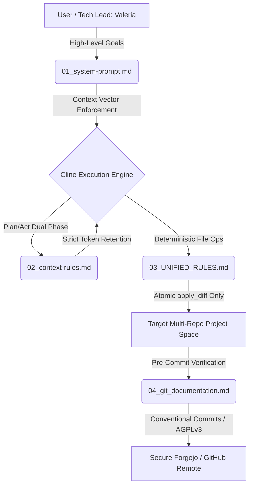

# AI-Driven Agent Orchestration Rules

🌐 **English** | [Русский](README.ru.md)

A production-grade framework of system prompts, execution protocols, and deterministic constraints designed for autonomous AI coding agents (such as Cline, Cursor, or local LLM instances). 

This framework is highly optimized for **local LLM inference** (`llama.cpp` + ROCm/HIP, utilizing models like `Qwen 3.8 27B Fable Distill`), enforcing low-overhead context retention, strict UNIX-way system programming architectures, and multi-tier development automation.



---

## Architecture Blueprint & Core Modules

* **`01_system-prompt.md` (System Persona & Global Context):** Establishes the agent's core identity (Maria, System Architect) under the direct supervision of Tech Lead **Valeria Fadeeva**. Maps out the full-scale distributed tech tree of the ecosystem (Core OS, Low-Level Init, RAG Systems, Network Security, Mobile and Desktop Clients).
* **`02_context-rules.md` (Context Management & Thinking Topology):** Enforces a mandatory dual-phase `PLAN / ACT` sequence. Eradicates computational self-reflection loops and verbal pollution in the chat interface to save local context tokens. Mandates automated architectural recipe extraction into external markdown registries.
* **`03_UNIFIED_RULES.md` (Unified AI-Agent Execution Protocol):** Chains the model to deterministic file actions. Prohibits global file overwrites, forcing atomic `apply_diff` micro-patches. Restricts file reading boundaries to function signatures if the codebase size exceeds 200 lines. Installs sandbox isolation safeguards.
* **`04_git_documentation.md` (Git Pipeline & Quality Constraints):** Automates the local git lifecycle using strict Conventional Commits specifications. Enforces pre-commit validation (prohibits commits if compilation or test execution chains fail). Permanently locks infrastructure standards to **Rust 2024 Stable** and **AGPL-3.0-only**.

---

## Core Operational Paradigm Shift

Unlike stock out-of-the-box configurations that encourage models to output conversational noise, this framework transforms your AI assistant into an automated execution daemon:

1. **Absolute Sovereignty:** Completely bans cloud-based telemetry leakages. Designed exclusively for air-gapped, sovereign *on-premise* physical hardware pipelines.
2. **Zero Verbal Waste:** The agent states its execution vector in one line, immediately triggers the native JSON system tool, and validates the output with a single line of status report. 
3. **Architecture-Driven:** Shifts the agent's focus away from micro-syntax memorization toward high-level system analysis, dependency matrix engineering, and native packaging deployment automation (`PKGBUILD`, `systemd`).

---

## Installation & System Deployment

To inject these policies as global runtime rules for your VS Code Cline environment on Arch Linux / Melawy OS:

```bash
# Clone the orchestration framework to your stable configuration space
git clone https://github.com ~/.config/Code/User/global-cline-rules

# Symlink or copy the files directly into your target agent configuration directories
```
