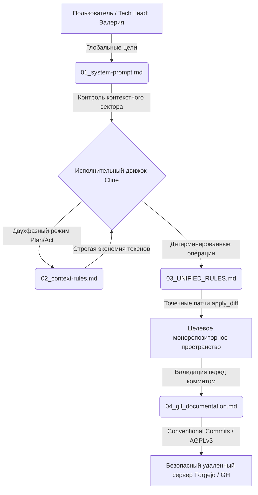

# AI-Driven Agent Orchestration Rules

🌐 [English](README.md) | **Русский**

Промышленный фреймворк системных промптов, протоколов выполнения и детерминированных ограничений, разработанный для автономных ИИ-агентов программирования (таких как Cline, Cursor или локальные экземпляры LLM).

Данный фреймворк глубоко оптимизирован для **локального инференса LLM** (`llama.cpp` + ROCm/HIP на базе моделей уровня `Qwen 3.8 27B Fable Distill`). Он обеспечивает жесткую экономию контекстного окна, принудительное соблюдение архитектурных канонов UNIX-way системного программирования и многоуровневую автоматизацию разработки.



---

## Архитектура и ключевые модули

* **`01_system-prompt.md` (Системный статус и глобальный контекст):** Определяет идентичность агента (Мария, Системный архитектор) под непосредственным руководством Tech Lead **Валерии Фадеевой**. Удерживает в памяти сквозное дерево технологий экосистемы (Core OS, низкоуровневый Init, RAG-системы, сетевая безопасность, мобильные и десктопные клиенты).
* **`02_context-rules.md` (Управление контекстом и алгоритмы мышления):** Вводит обязательную двухфазную последовательность действий `PLAN / ACT`. Полностью искореняет циклы саморефлексии и словесный мусор в чате для экономии токенов локального контекста. Автоматизирует фиксацию сложных архитектурных решений во внешних реестрах.
* **`03_UNIFIED_RULES.md` (Унифицированный протокол автономного выполнения):** Привязывает модель к строго детерминированным операциям с файлами. Запрещает полную перезапись файлов, принуждая к атомарным микро-патчам через `apply_diff`. Ограничивает чтение больших файлов (>200 строк) только сигнатурами функций. Включает защитные барьеры песочницы.
* **`04_git_documentation.md` (Git-пайплайн и стандарты качества):** Автоматизирует жизненный цикл Git по спецификации Conventional Commits. Блокирует коммиты, если компиляция или тесты завершаются ошибкой. Намертво фиксирует системные константы разработки на **Rust 2024 Stable** и лицензию **AGPL-3.0-only**.

---

## Ключевые преимущества парадигмы

В отличие от стандартных базовых конфигураций, которые поощряют модели генерировать тонны разговорного шума, данный фреймворк превращает вашего ИИ-ассистента в послушного исполнительного демона:

1. **Абсолютный суверенитет:** Полный запрет на утечку телеметрии во внешние облака. Разработано исключительно для изолированных, суверенных *on-premise* пайплайнов на физическом оборудовании.
2. **Нуль вербальных отходов:** Агент заявляет свой вектор выполнения в одну строку, мгновенно вызывает нативный JSON-инструмент и валидирует результат краткой статусной строкой.
3. **Архитектурный фокус:** Смещает фокус модели с зазубривания синтаксиса на высокоуровневый системный анализ, проектирование матриц зависимостей и нативную автоматизацию деплоя (`PKGBUILD`, `systemd`).

---

## Установка и развертывание в системе

Чтобы применить эти правила в качестве глобальных политик для вашей среды VS Code Cline в Arch Linux / Melawy OS:

```bash
# Клонируйте фреймворк оркестрации в стабильное конфигурационное пространство
git clone https://github.com ~/.config/Code/User/global-cline-rules

# Создайте симлинки или скопируйте файлы напрямую в директории глобальных правил агента
```
